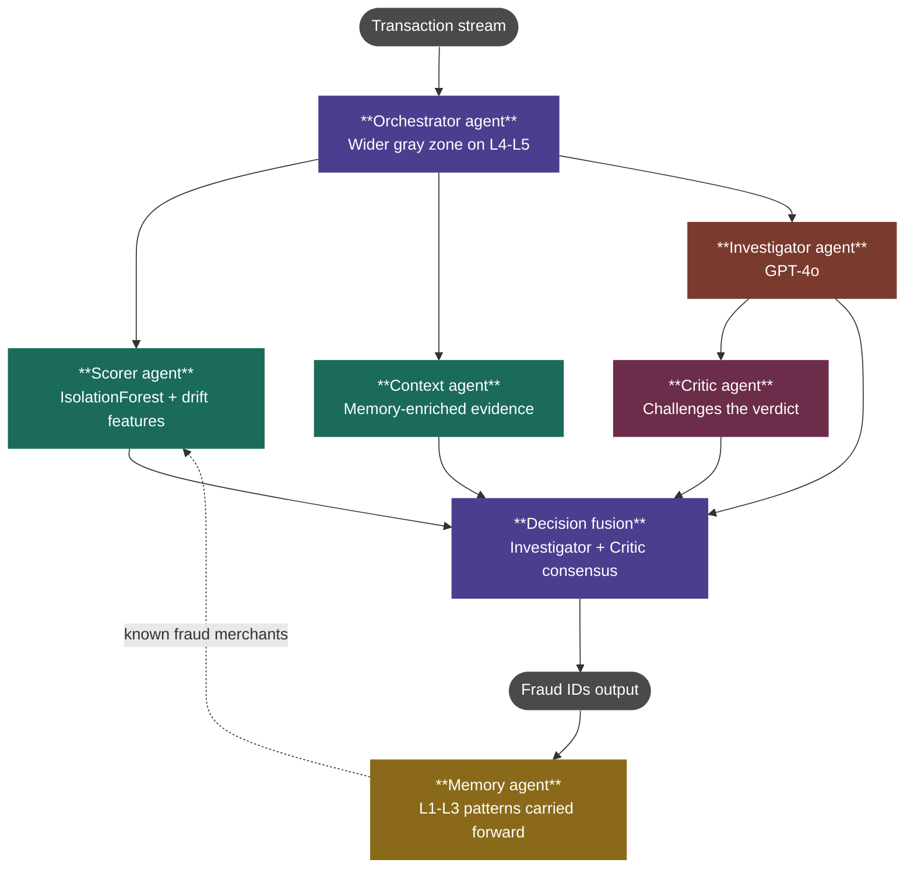

# Reply Mirror — Fraud Detection System

**Reply Challenge 2026** · **134th out of 1,971 teams** (top 6.8%)

---

## Overview

A multi-agent fraud detection system built for the Reply Mirror challenge. The system detects fraud patterns that drift across 5 levels — new merchants, shifted time windows, new geographies, new amount patterns, and new behavioural sequences — all without fraud labels in the training data.

**Key constraints:**
- 5 levels to submit within 6 hours (only the first submission per level counts)
- Total LLM budget of $160 split across levels
- Agent-based approach required (deterministic-only approaches are penalised)
- Unsupervised setting — no fraud labels in training data

---

## Architecture



**Routing logic:**
```
score = scorer.predict(tx)

if score < gray_low:    → legit  (no LLM call)
elif score > gray_high: → fraud  (no LLM call)
else:                   → build context → Investigator judges
                          → (L4-5) Critic verifies
```

## Setup

```bash
pip install -r requirements.txt
cp .env.example .env
# Fill in your keys
```

**Required environment variables (`.env`):**
```
OPENROUTER_API_KEY=...
LANGFUSE_PUBLIC_KEY=...
LANGFUSE_SECRET_KEY=...
LANGFUSE_HOST=...
TEAM_NAME=reply-mirror
```

## Running

```bash
# Dry run (no output file)
python main.py --level 1

# Generate submission file
python main.py --level 1 --submit
```

Submission is written to `submissions/level_{N}.txt`.

---

## Agent Details

### Scorer (`agents/scorer.py`)
- **Model:** Isolation Forest — unsupervised anomaly detection, no fraud labels needed
- **Features:** amount z-score, is_night, is_new_merchant, payment method risk, tx type risk, balance ratio, days since last tx, `is_known_fraud_merchant` (injected from Memory)
- Retrained from scratch at each level — prior models are never reused

### Context (`agents/context.py`)
- Builds an evidence bundle per transaction: user profile, GPS location match, SMS/email phishing signals
- L3+: audio fraud signals from STT-transcribed call recordings
- Produces `risk_flags` consumed by the Investigator prompt

### Investigator (`agents/investigator.py`)
Popperian falsification + Bayesian updating:
1. Generate competing hypotheses (H0 = legitimate, H1–H4 = fraud types)
2. Assign priors from Scorer risk score, drift signal, and Memory hypotheses
3. Generate falsifiable predictions for each hypothesis
4. Test predictions against the Context evidence bundle
5. Bayesian posterior update based on survived/failed predictions
6. Highest-posterior hypothesis wins

Falls back to rule-based verdict if no LLM is configured.

### Critic (`agents/critic.py`)
L4-L5 only. Audits the Investigator's reasoning structure without re-investigating:
- **Check 1 — Logical validity:** does the verdict match the highest-posterior hypothesis?
- **Check 2 — Evidential sufficiency:** fraud verdict requires ≥2 tested predictions with ≥1 high-weight survivor
- **Check 3 — Undercutting defeaters:** are any high-diagnostic signals (GPS mismatch, phishing) present in context but ignored by the Investigator?

### Memory (`agents/memory.py`)
Four internal components operating at three timescales:
- **FraudMerchantTracker:** set of merchants seen in confirmed fraud — O(1) lookup, feeds back into Scorer
- **AccountGraph:** sender-recipient edge graph, tracks new counterparties and fraud-connected accounts
- **DriftMonitor:** rolling Wasserstein distance on hour distribution + log-amount median shift + new location/counterparty fraction → single `drift_score`
- **HypothesisGenerator:** one LLM call per level boundary, produces hypotheses about evolving attack patterns

### STT (`agents/stt.py`)
L3+. Transcribes MP3 call recordings with Whisper (`tiny` model), extracts fraud signals, injects into the Context bundle.

---

## Critical Safeguards (do not remove or weaken)

### Cost Tracker (`utils/cost_tracker.py`)
Every LLM call must go through this module.
- At 90% of level budget: Orchestrator narrows the gray zone by ±0.10
- At 100%: LLM calls are blocked; remaining gray-zone cases fall back to Scorer threshold

### Submission Validator (`utils/validator.py`)
Must be called before writing any submission file. Rejects:
- Empty submission
- All transactions flagged
- IDs not present in the evaluation set
- Duplicate IDs

---

## Repository Layout

```
reply-mirror/
├── main.py                  # entry: python main.py --level N [--submit]
├── config.py                # LEVEL_CONFIG table
├── agents/
│   ├── orchestrator.py      # Orchestrator + Decision Fusion
│   ├── scorer.py            # IsolationForest scorer
│   ├── context.py           # evidence builder
│   ├── investigator.py      # LLM gray-zone judge
│   ├── memory.py            # cross-level pattern store
│   ├── critic.py            # L4-L5 verifier
│   └── stt.py               # L3+ audio transcription
├── utils/
│   ├── cost_tracker.py      # LLM budget enforcement (critical safeguard)
│   └── validator.py         # submission validation (critical safeguard)
├── prompts/                 # Investigator / Memory LLM prompts
├── data/level_{N}/
│   ├── {theme} - train/     # transactions.csv, users.json, locations.json, sms.json, mails.json
│   └── {theme} - validation/
├── submissions/             # level_1.txt … level_5.txt
└── requirements.txt
```

---

## Dependencies

```
pandas, numpy, scikit-learn  # data processing + IsolationForest
openai, anthropic             # LLM clients
langchain-openai              # OpenRouter interface
langfuse                      # LLM tracing (official challenge method)
python-dotenv
ulid-py
```

---

## Team Role Split

| Role | Components |
|------|-----------|
| Yunbeom Choe| Orchestrator, Decision Fusion, CostTracker, Validator |
| Katalin Pazmany | Scorer, Context |
| Alex Yeung | Investigator, Memory, Critic, STT |

Interface signatures are a team contract — flag any changes to all roles before committing.
